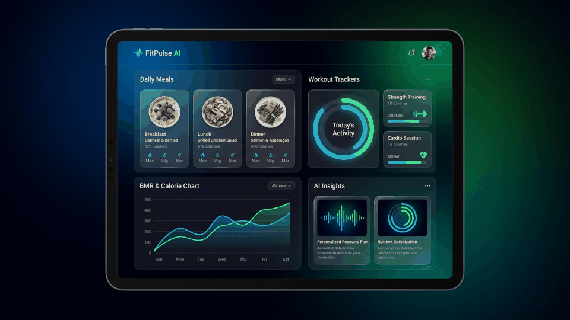

# FitPulse - AI Personal Trainer & Nutrition Coach 🏋️‍♂️🥗

> **FitPulse** is an autonomous conversational fitness and nutrition agent built with the **Google Agent Development Kit (ADK)** and deployed on **Vertex AI Agent Runtime** and **Google Cloud Run**.



---

## 🌟 Overview

FitPulse acts as your personal health coach. It collects user health metrics, calculates Basal Metabolic Rate (BMR) and Total Daily Energy Expenditure (TDEE), generates custom meal plans according to dietary allergies, logs completed workout sessions and rep counts, and provides natural herbal health guidance grounded in Culpeper's Herbal book.

---

## ✨ Key Features

- 📝 **Interactive Health Survey & Metric Calculations**: Computes exact BMR, TDEE, daily calorie targets (deficit/surplus), and macro breakdowns (Protein, Carbs, Fats).
- 🥗 **Custom Meal Plan Suggestions**: Recommends daily meal plans tailored to user fitness goals while respecting saved dietary allergies and restrictions.
- 🏋️ **Workout & Rep Logger**: Allows users to log exercise names, sets, reps, and weights directly into Firestore.
- 🌿 **Grounded Herbal Health Advice (RAG)**: Answers wellness questions using a Vertex AI RAG corpus grounded on *Culpeper's Complete Herbal*.
- 📊 **Daily Analytics & Interactive Charts**: Features a live dashboard with Chart.js visualization showing daily calories consumed and total workout reps over time.
- 🎨 **A2UI Rich Display Cards**: Emits structured **A2UI (v0.8 Basic Catalog)** components (Cards, Columns, Rows, Text, Icons) rendered natively in the frontend.

---

## 🛠️ Google Cloud Tools & Architecture

FitPulse leverages a comprehensive suite of Google Cloud and AI Platform services:

| Google Cloud Tool | Description & Usage in FitPulse |
| :--- | :--- |
| **🧠 Vertex AI Memory Bank** | Persists user profiles, fitness goals, and dietary restrictions across sessions so the agent remembers user preferences. |
| **🗄️ Google Cloud Firestore** | Stores workout session logs (`workout_logs`) and meal history (`meal_logs`) for user tracking and dashboard analytics. |
| **📦 Google Cloud Storage** | Stores public media and generated image assets (`gs://fitpulse-assets-qwiklabs-gcp-03-a5fda0a88d46`). |
| **📚 Vertex AI RAG Engine** | Serverless RAG corpus providing grounded answers from *Culpeper's Complete Herbal* (`pg49513.txt`). |
| **🖼️ Imagen 3 (Image Gen)** | Generates visual meal prep previews and workout posture guides. |
| **🃏 A2UI (v0.8 Basic Catalog)** | Formats agent responses into rich UI cards using `A2uiSchemaManager`. |
| **🚀 Google Cloud Run** | Hosts the production FastAPI proxy and single-page web app connecting to the deployed Agent Runtime via A2A. |

---

## 🚀 Getting Started Locally

### Prerequisites
- Python 3.10+
- Google Cloud SDK (`gcloud`) with active authentication

### 1. Clone & Install Dependencies
```bash
cd fitpulse/frontend
pip install -r requirements.txt
```

### 2. Run the Local Frontend Proxy
```bash
export AGENT_ENGINE_RESOURCE_NAME="projects/810401478372/locations/us-central1/reasoningEngines/1096562187834490880"
export AGENT_DIRECTORY="app"
export PORT=8080

python main.py
```
Open **`http://localhost:8080`** in your browser.

---

## ☁️ Production Cloud Run Deployment

The frontend proxy can be deployed to Cloud Run with a single command:

```bash
gcloud run deploy fitpulse-frontend \
  --source ./frontend \
  --region us-central1 \
  --set-env-vars AGENT_ENGINE_RESOURCE_NAME="projects/810401478372/locations/us-central1/reasoningEngines/1096562187834490880",AGENT_DIRECTORY="app" \
  --allow-unauthenticated
```

Grant the Cloud Run service account access to Vertex AI:
```bash
gcloud projects add-iam-policy-binding qwiklabs-gcp-03-a5fda0a88d46 \
  --member="serviceAccount:810401478372-compute@developer.gserviceaccount.com" \
  --role="roles/aiplatform.user"
```

---

## 📜 License
Built for the **Build with Gemini / Agent Platform Workshop**.
